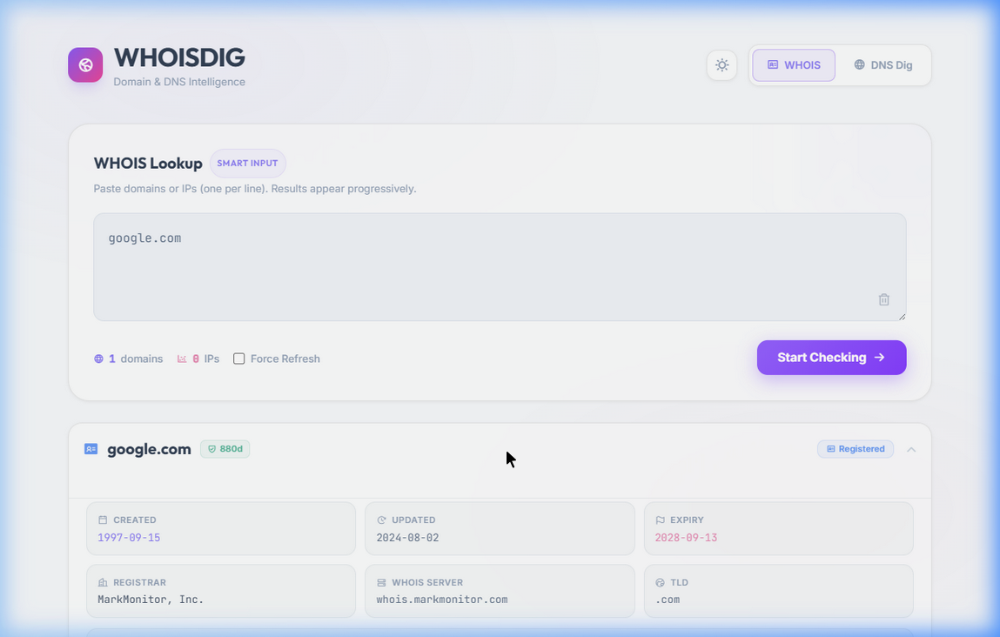
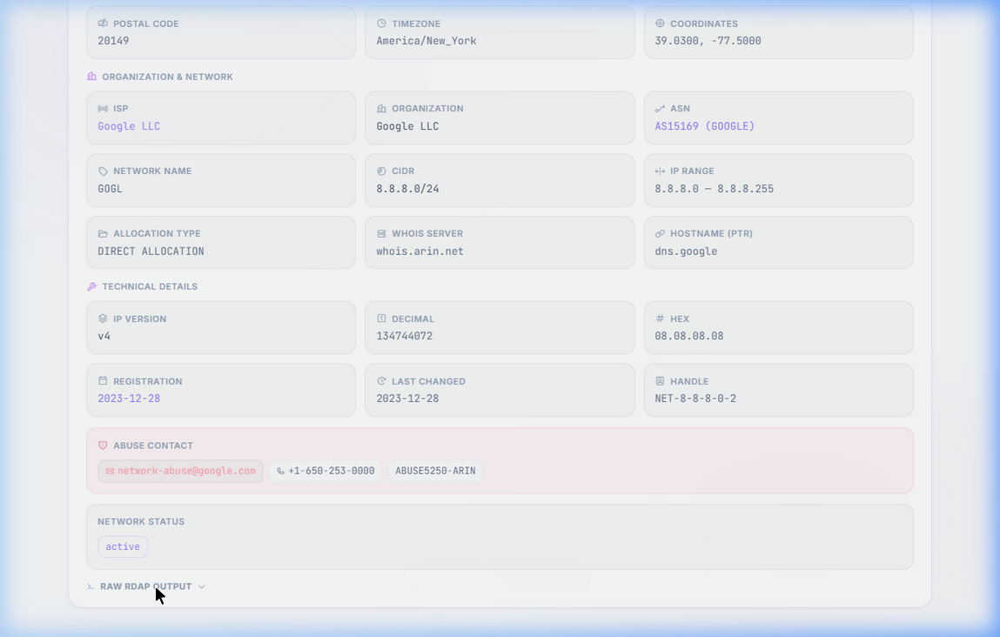
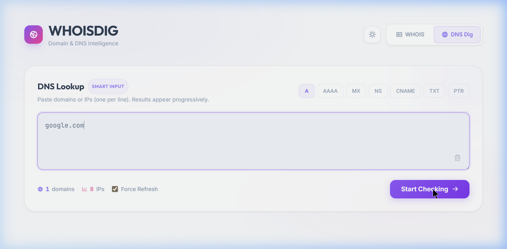

<p align="center">
  
</p>

<h1 align="center">WHOISDIG</h1>

<p align="center">
  <strong>Intelligent WHOIS, RDAP & DNS Lookup Engine</strong><br/>
  A fast, hybrid domain intelligence tool with IP geolocation, circuit breakers, and smart caching.<br><br>
  🚀 <b>Live Demo:</b> <a href="https://apps.nizen.my.id/whoisdig/">https://apps.nizen.my.id/whoisdig/</a>
</p>

<p align="center">
  
  
  
  
  
</p>

---

## ✨ Features

| Feature | Description |
|---|---|
| **Hybrid Resolution** | WHOIS (Port 43) + RDAP (REST/JSON) with automatic fallback |
| **IANA Server Discovery** | Dynamically resolves authoritative WHOIS/RDAP servers per TLD |
| **Referral Chaining** | Follows WHOIS referrals up to 2 levels deep for accurate results |
| **IP Intelligence** | RDAP network data + GeoIP enrichment (location, ASN, ISP, proxy detection) |
| **Circuit Breaker** | Automatic fault isolation — prevents cascading failures from slow WHOIS servers |
| **Smart Cache (SWR)** | Stale-While-Revalidate file cache with file locking for high concurrency |
| **Bulk Processing** | Process up to 500 domains/IPs with progressive real-time UI updates |
| **Public Suffix List** | Accurate multi-level TLD resolution via Mozilla's PSL (auto-updated) |
| **DNS Dig** | Full DNS record lookup — A, AAAA, MX, NS, CNAME, TXT, SOA, SRV, PTR |
| **Rate Limiting** | File-based sliding window rate limiter with automatic garbage collection |
| **Dark / Light Mode** | Responsive, glassmorphism UI built with Tailwind CSS |

---

## 📸 Screenshots

<details open>
<summary><strong>Click to hide screenshots</strong></summary>

### Domain WHOIS Lookup (Expanded)



### IP Intelligence (Expanded Details)



### DNS Dig



</details>

---

## 🚀 Quick Start

### Requirements

- PHP >= 7.4
- Extensions: `curl`, `json`, `intl` (for IDN support)
- Apache or Nginx with `mod_rewrite` (optional)

### Installation

```bash
# Clone the repository
git clone https://github.com/mbahnizen/whoisdig.git
cd whoisdig

# Ensure storage directories are writable
chmod -R 755 storage/

# Point your web server document root to the public/ directory
# For quick local testing:
php -S localhost:8000 -t public/
```

Open `http://localhost:8000` in your browser.

---

## 📡 API Usage

All endpoints are served from `public/api.php`.

### Domain WHOIS Lookup

```bash
GET /api.php?action=whois-single&domain=google.com
```

<details>
<summary><strong>Example Response</strong></summary>

```json
{
  "success": true,
  "domain": "google.com",
  "tld": "com",
  "registrar": "MarkMonitor Inc.",
  "whois_server": "whois.markmonitor.com",
  "created": "1997-09-15T04:00:00+0000",
  "updated": "2019-09-09T15:39:04+0000",
  "expires": "2028-09-13T07:00:00+0000",
  "status": ["clientDeleteProhibited", "clientTransferProhibited", "clientUpdateProhibited", "serverDeleteProhibited", "serverTransferProhibited", "serverUpdateProhibited"],
  "nameservers": ["ns1.google.com", "ns2.google.com", "ns3.google.com", "ns4.google.com"],
  "lifecycle": {
    "age_days": 10077,
    "days_until_expiry": 880
  },
  "raw": "<base64-encoded raw WHOIS output>"
}
```

</details>

### IP Intelligence

```bash
GET /api.php?action=whois-single&domain=8.8.8.8
```

<details>
<summary><strong>Example Response</strong></summary>

```json
{
  "success": true,
  "is_ip": true,
  "domain": "8.8.8.8",
  "organization": "Google LLC",
  "country": "US",
  "network_name": "GOGL",
  "cidr": "8.8.8.0/24",
  "ip_version": "v4",
  "asn": "AS15169",
  "asn_name": "GOOGLE",
  "hostname": "dns.google",
  "geo": {
    "country_name": "United States",
    "region": "Virginia",
    "city": "Ashburn",
    "isp": "Google LLC",
    "is_proxy": false,
    "is_hosting": true,
    "is_mobile": false
  },
  "ip_decimal": "134744072",
  "ip_hex": "08.08.08.08"
}
```

</details>

### Bulk WHOIS

```bash
POST /api.php?action=whois-bulk
Content-Type: application/json

{
  "domains": ["google.com", "github.com", "8.8.8.8"],
  "refresh": false
}
```

### DNS Dig

```bash
GET /api.php?action=dig&domain=google.com&type=MX
```

<details>
<summary><strong>Example Response</strong></summary>

```json
{
  "success": true,
  "domain": "google.com",
  "record_type": "MX",
  "results": ["10 smtp.google.com", "20 smtp2.google.com"]
}
```

</details>

### Force Refresh (bypass cache)

```bash
GET /api.php?action=whois-single&domain=example.com&refresh=1
```

---

## ☁️ Deployment

WHOISDIG is natively built to be deployed on **Wasmer Edge**, offering edge-based routing and WASIX compatibility without Docker.

### Deploy to Wasmer Edge

1. Install the [Wasmer CLI](https://wasmer.io).
2. Authenticate using `wasmer login`.
3. Run the deployment command:

   ```bash
   wasmer deploy
   ```

### Continuous Deployment (CI/CD)

This repository includes a GitHub Actions workflow (`.github/workflows/wasmer-deploy.yml`) for automated deployments.
To enable it:

1. Go to your GitHub Repository Settings -> Secrets and variables -> Actions.
2. Add a new secret named `WASMER_TOKEN` with your Wasmer API token.
3. Push to the `main` branch to trigger an automatic deployment.

### Persistent Logs and Cache (S3 Volumes)

Wasmer Edge provides S3-compatible persistent storage. Your cache and logs are mounted safely to `/app/storage`.
You can access your production cache and logs via the CLI using `rclone` or `aws s3`:

```bash
# Get your S3 credentials
wasmer app volume credentials <namespace>/whoisdig

# Example: List logs using rclone (Note: use path-style access)
rclone ls edge-whoisdig:storage-volume/logs/ --s3-force-path-style=true
```

---

## 🏗️ Architecture

```
public/
├── index.html          # Frontend SPA
├── api.php             # API router (single entry point)
├── js/app.js           # Frontend logic (progressive loading)
└── css/app.css         # Styles (glassmorphism, dark/light)

config/
└── app.php             # Global config, autoloader, rate limiting

src/
├── Clients/
│   ├── WhoisClient.php     # Raw WHOIS (Port 43) with retry + circuit breaker
│   ├── RdapClient.php      # RDAP REST client with circuit breaker
│   └── GeoIpClient.php     # GeoIP enrichment (multi-provider fallback)
├── Parsers/
│   ├── WhoisParser.php     # Regex-based WHOIS response parser
│   ├── RdapParser.php      # Structured RDAP JSON parser
│   └── ReferralParser.php  # WHOIS referral server extractor
├── Resolvers/
│   ├── WhoisService.php    # Core orchestrator (hybrid resolution engine)
│   ├── WHOISChecker.php    # Public facade / entry point
│   ├── DigChecker.php      # DNS record resolver
│   ├── IanaResolver.php    # IANA WHOIS/RDAP server discovery
│   └── TldResolver.php     # TLD detection via Mozilla PSL
└── Utils/
    ├── Cache.php           # File-based SWR cache with flock()
    ├── CircuitBreaker.php  # Fault isolation for external services
    └── Metrics.php         # JSONL performance logging

storage/
├── cache/              # Cached WHOIS/RDAP/GeoIP results
└── logs/               # Activity logs, metrics, rate-limit data
```

### How a lookup works

```
Browser → api.php → WHOISChecker → WhoisService
                                       ├── Is IP? → RDAP /ip → GeoIP enrichment → merge
                                       └── Is Domain? → TLD resolve → IANA discover
                                              ├── WHOIS Port 43 → referral chain → parse
                                              └── Fallback → RDAP /domain → parse
                                       Cache ←→ (all steps)
                                       CircuitBreaker ←→ (all external calls)
```

---

## ⚙️ Design Philosophy

### Why hybrid resolution?

Legacy WHOIS (Port 43) has the widest coverage, but modern TLDs (`.dev`, `.app`, `.page`) only support RDAP. WHOISDIG uses **RDAP-first** for modern TLDs and **WHOIS-first** for legacy TLDs, with automatic fallback in both directions.

### Why Stale-While-Revalidate cache?

WHOIS servers are slow (500ms–7s) and rate-limited. SWR ensures:

- **Instant responses** from cache for repeat queries
- **Background revalidation** when cache is stale
- **No thundering herd** — file locking prevents duplicate fetches

### Why circuit breakers?

External WHOIS/RDAP servers can be unreliable. The circuit breaker:

- Tracks failures per server
- Temporarily blocks requests to failing servers (cooldown period)
- Automatically recovers when the server comes back online

---

## 🔒 Security

- **Input Sanitization** — All input is cleaned before processing (trim + lowercase)
- **Output Encoding** — HTML escaping at the display layer prevents XSS
- **Rate Limiting** — Sliding window (120 req/hour per IP) with `Retry-After` support
- **Storage Protection** — `.htaccess` blocks direct access to cache/logs
- **CORS** — Configurable via `WHOISDIG_CORS_ORIGIN` environment variable
- **Error Isolation** — Internal errors are logged; clients receive generic messages

---

## 🗺️ Roadmap

- [ ] IPv6 PTR lookup support
- [ ] WHOIS response diffing (track changes over time)
- [ ] Webhook notifications for domain expiry
- [ ] REST API authentication (API keys)
- [ ] Docker image
- [ ] Export results (CSV / JSON)
- [ ] Batch upload via file (CSV/TXT)

---

## 🤝 Contributing

Contributions are welcome! Please follow these steps:

1. Fork the repository
2. Create your feature branch (`git checkout -b feature/amazing-feature`)
3. Commit your changes (`git commit -m 'Add amazing feature'`)
4. Push to the branch (`git push origin feature/amazing-feature`)
5. Open a Pull Request

Please ensure your code:

- Follows the existing code structure
- Includes appropriate error handling
- Does not introduce new external dependencies without discussion

---

## 📄 License

This project is licensed under the **MIT License** — see the [LICENSE](LICENSE) file for details.

---

<p align="center">
  Built with ❤️ for the domain intelligence community
</p>
